# AI Creator OS

**Hệ điều hành "công ty một người": mạng lưới AI creator tự vận hành — mỗi tài khoản là một creator AI với persona riêng, tự tìm niche, tự sản xuất video, tự livestream, tự đăng đa nền tảng. Bạn chỉ bật ON và theo dõi.**


> 🖼️ **Ghi chú trung thực:** các ảnh concept trong README này do AI tạo để minh họa ý tưởng — không phải ảnh chụp sản phẩm thật. Hai video demo bên dưới được **dựng thật bằng pipeline FFmpeg + lồng tiếng AI** của dự án.

---

## 🎬 Xem nhanh

### Quy trình tự động — từ săn sản phẩm đến đăng video

<video src="docs/assets/demo-pipeline.mp4" controls width="100%"></video>

*Video dựng thật bằng pipeline của dự án (FFmpeg + lồng tiếng AI): AI Hunter tìm sản phẩm → AI viết kịch bản → lồng tiếng → dựng video → đăng TikTok/Facebook/YouTube.*

### Video affiliate demo — sản phẩm do AI làm từ A–Z

<video src="docs/assets/demo-affiliate-video.mp4" controls width="360"></video>

*Video dọc 1080x1920 mẫu: kịch bản AI viết, lồng tiếng AI, phụ đề tự động — đúng chuẩn pipeline Content của hệ thống.*

### Video concept 1 phút — do Milo (AI assistant) dựng

<video src="docs/assets/demo-1min.mp4" controls width="100%"></video>

*6 clip AI (mỗi clip 10s, phong cách điện ảnh navy/cyan nhất quán) ghép bằng FFmpeg: mạng lưới creator → dashboard → 6 persona → studio livestream → TikTok Shop → emblem. Clip minh họa khả năng B-roll miễn phí của Milo cho video ngắn.*

### Dashboard điều khiển (giao diện thật)

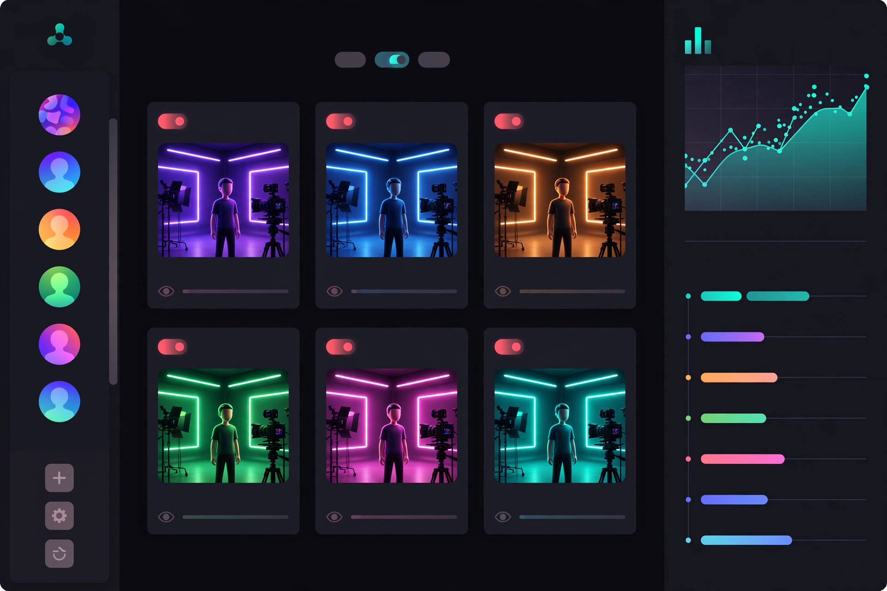

*Mọi quản trị qua UI web — không dùng CLI: tài khoản, onboarding, topic, lịch live, sản xuất video, đa nền tảng, shop, analytics, cài đặt, kill switch. Chạy `./aicos` rồi mở `http://localhost:8080`.*

---

## 💰 Vòng tiền — một vòng duy nhất

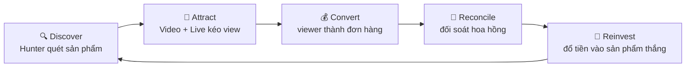

Mọi agent chỉ phục vụ một mục tiêu: **đồng hoa hồng quay vòng nhanh hơn, to hơn**.

---

## 🧭 Mô hình chốt: AI Creator Network (2026-10-01)

> Chi tiết đầy đủ: [`docs/MODEL.md`](docs/MODEL.md). Đây là bản tóm tắt để bạn đọc 1 phút.

**Một hệ thống, N tài khoản TikTok.** Mỗi account là một "AI creator" với persona riêng — tự live giải trí theo giờ được phân bổ, thu **quà tặng LIVE**, bán **affiliate qua video ngắn**, nhạc AI tự sáng tác thì phát hành lấy **royalty**. Bạn chỉ **bật ON, thêm account, và theo dõi**.

| Persona (mỗi account 1 cái) | Live làm gì | Nguồn thu |
|---|---|---|
| 📖 Storyteller | Kể chuyện, phim ngắn AI | Gift + affiliate sách |
| 🎓 AI Teacher | Dạy tiếng Anh qua truyện | Gift + affiliate sách/khóa học |
| 🎮 Game Master *(phase 2)* | AI tự chơi game được phép | Gift + affiliate gear |
| 💻 AI Coder *(phase 2)* | Live code game/mini-app theo yêu cầu viewer | Gift (đề xuất tính năng) |
| 🎤 AI Musician *(phase 3)* | Hát nhạc AI tự sáng tác | Gift + SoundOn royalty |
| 💃 Dancer *(phase 4)* | Nhảy theo trend | Gift |

**Bạn làm 3 việc trên dashboard web:** bật/tắt master switch · thêm account (username + gợi ý niche, AI tự research) · theo dõi.
**Hệ thống tự làm phần còn lại:** research niche → gán persona → đăng video cày đủ 1.000 follow → xếp lịch live giờ vàng (tối đa 2 live cùng lúc trên M1 32GB) → live → đối soát → tối ưu.

**Ngôn ngữ chốt:** **100% Go** — orchestrator, scheduler, stream, API/dashboard, provider chains, governance gói trong **1 binary `aicos`** (~15MB, không cần cài Python/venv/pip, RAM chỉ vài chục MB khi chạy). **SQLite WAL** cho sổ cái. Model local (VieNeu-TTS v3, llama-server) chạy như tiến trình phụ độc lập do binary quản lý — giống FFmpeg, không phải code của dự án.

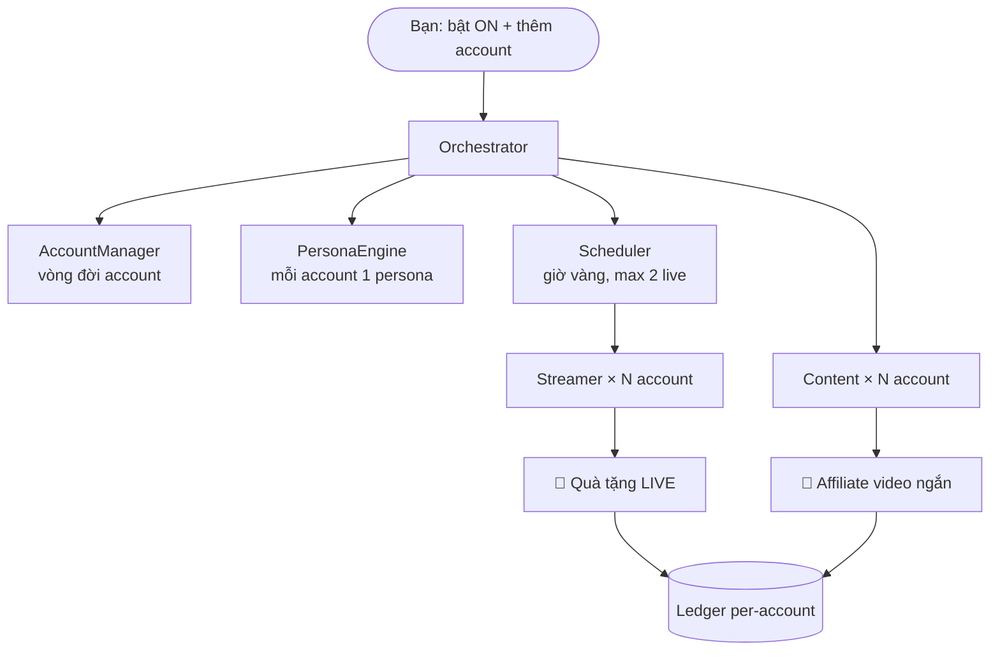

---

## 🏗️ Kiến trúc tổng quan

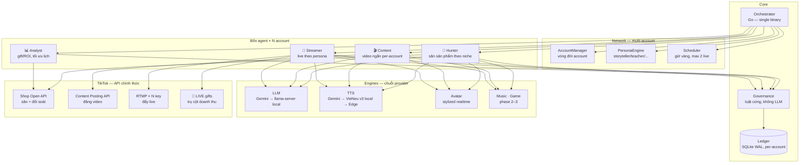

**Nguyên tắc chọn công nghệ:** nhẹ, ít RAM/CPU/SSD → **100% Go** trong 1 binary duy nhất (không Python runtime, không venv/pip); **SQLite WAL** cho sổ cái. API miễn phí trước, local fallback sau (tự động chuyển khi hết quota), trả phí chỉ khi tùy chọn — tất cả chỉnh được trong trang Settings.

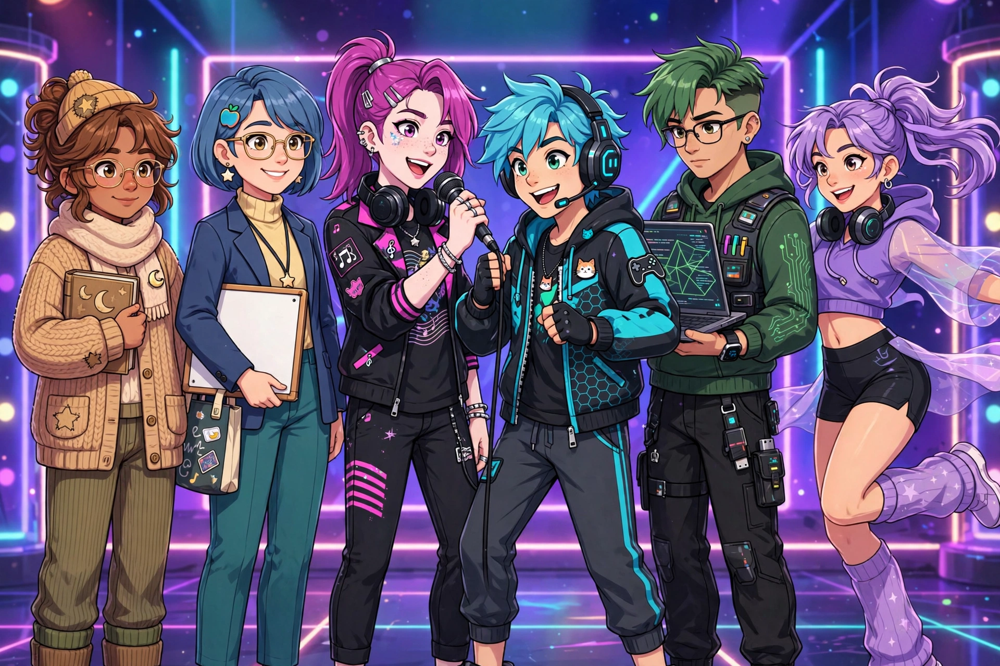

---

## 🤖 Từng agent làm gì

### 🎯 Hunter — thợ săn sản phẩm (`internal/agents/hunter`)

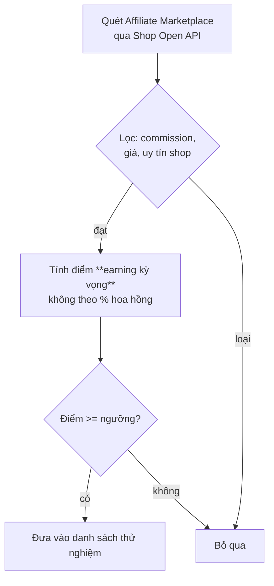

- Điểm khắt khe: sản phẩm 15% hoa hồng × bán chạy **thắng** sản phẩm 40% hoa hồng × ế.
- Dùng endpoint chính thức `Creator Search Open Collaboration Product` (sort theo commission, units_sold).

### 🎬 Content — xưởng video (`internal/agents/content`)

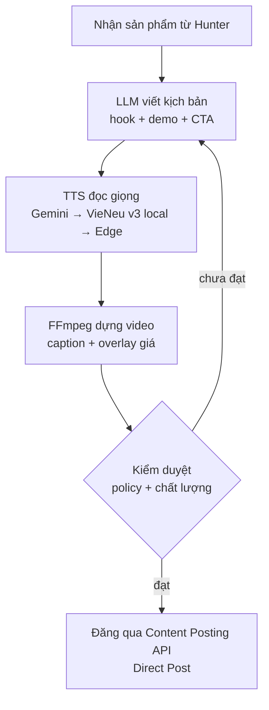

- Đăng hands-free sau khi app qua audit TikTok (~1 tháng). Giới hạn ~15 video/ngày.

### 📡 Streamer — đạo diễn live (`internal/agents/streamer`)

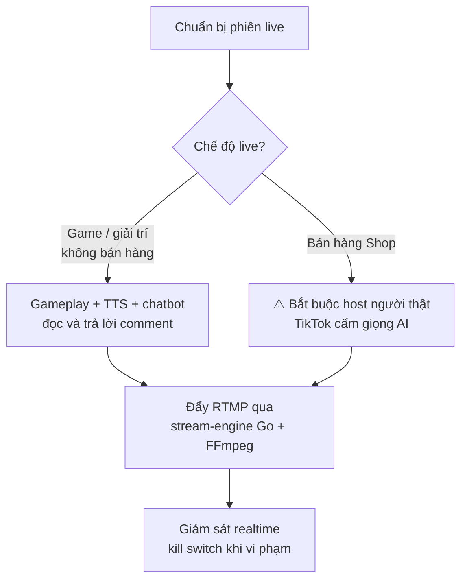

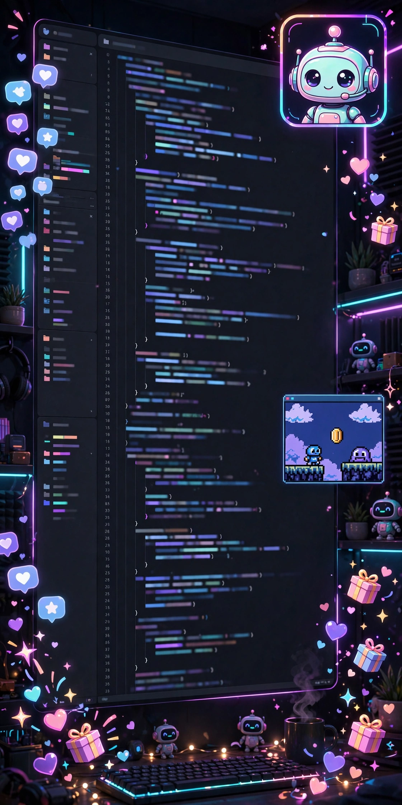

*Concept: live có host người + AI điều khiển overlay, ánh sáng, analytics.*

> ⚠️ **Phát hiện policy quan trọng (10/2026):** TikTok Shop cấm giọng AI, audio thu sẵn và avatar hoạt hình >50% màn hình trong **livestream bán hàng**. Live game/giải trí không dùng tính năng Shop nằm ngoài phạm vi cấm này. Chi tiết: `docs/RESEARCH/tiktok_live_policy.md`.

### 📊 Analyst — kế toán lạnh lùng (`internal/agents/analyst`)

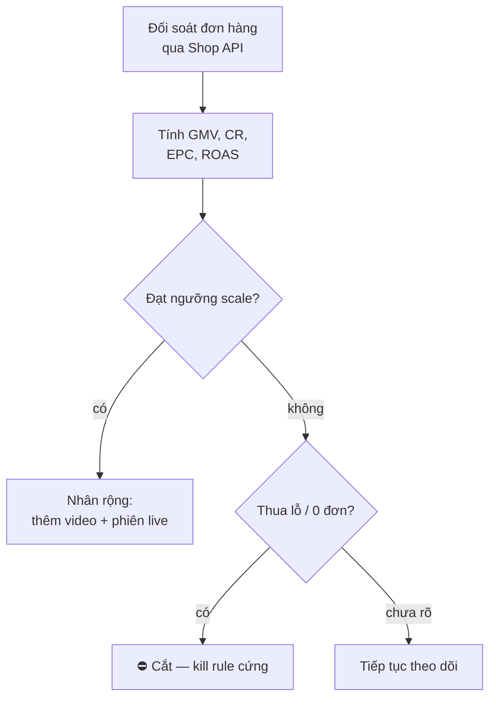

- Kill rule không cảm xúc: 0 đơn sau X view/phiên live là cắt, không tranh cãi.
- Số liệu chỉ ghi từ API TikTok — **không bao giờ tự bịa doanh thu**.

---

## 🛡️ Governance — luật cứng, không phải lời khuyên

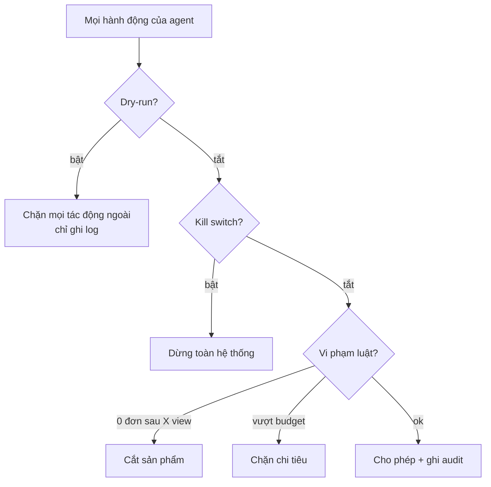

- Governance **không chứa LLM** — toàn bộ là code xác định, test được.
- Sổ cái append-only: tiền vào/ra đều có chứng từ.

---

## 🖥️ Chạy trên Mac của bạn

```bash
./aicos   # mở http://localhost:8080
```

Không cài đặt gì thêm (ngoài FFmpeg cho dựng video/live). Model local
(VieNeu-TTS v3 ~334MB, LLM GGUF ~5GB) tải bằng một nút trong trang Settings.

Toàn bộ quản trị qua **dashboard web** — không cần chạm CLI:
**Trang chủ** (tổng quan, kill switch) · **Tài khoản** (thêm account, onboarding tự động, topic plan) · **Lịch live** (xếp giờ vàng) · **Sản xuất video** (tạo video từ kịch bản + lồng tiếng AI) · **Đa nền tảng** (TikTok/Facebook/YouTube) · **Shop Affiliate** (kệ sản phẩm) · **Phân tích** (doanh thu, gift, chi phí API) · **Cài đặt** (API key, dry-run).

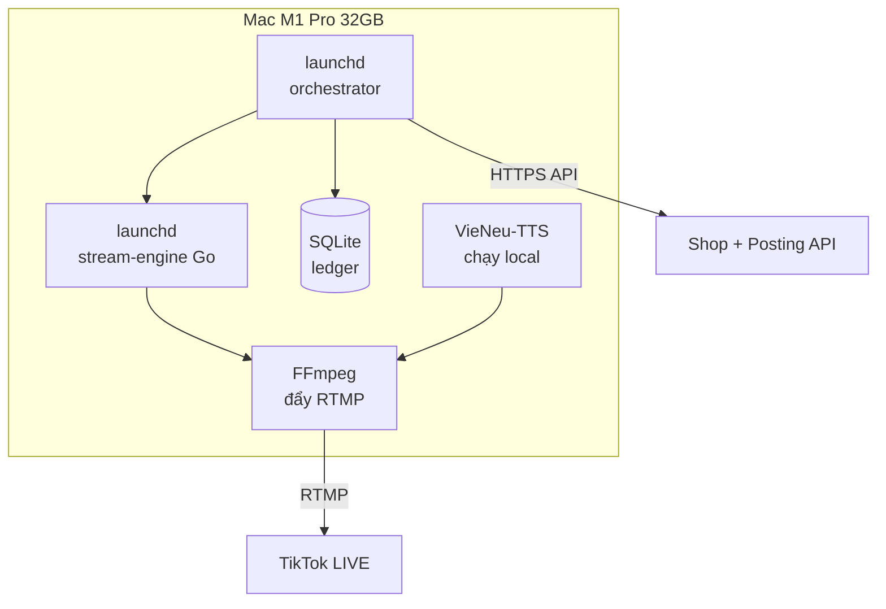

- Hai service `launchd` tự chạy khi mở máy, tự khởi động lại khi sập.
- Stream-engine giới hạn tài nguyên, tự reconnect khi rớt mạng.

---

## 🧪 Demo thử (rehearsal offline)

```bash
go test ./...   # chạy toàn bộ vòng tiền với dữ liệu giả, không chạm TikTok thật
```

Video demo thật sẽ được quay lại sau khi chạy rehearsal trên máy bạn.

---

## 📌 Trạng thái thật của dự án (v0.5-go — AI Creator OS)

| Phần | Trạng thái |
|---|---|
| Rebrand: AI Creator OS (không còn chỉ là affiliate) | ✅ Tên, hình concept, video demo mới |
| Web dashboard UI/UX full (thay CLI) | ✅ 9 trang quản trị, 1 binary Go |
| Video demo quy trình + video affiliate demo | ✅ Dựng thật bằng FFmpeg + TTS |
| Mô hình chốt (multi-account, persona, scheduler) | ✅ `docs/MODEL.md` |
| Kiến trúc + chốt ngôn ngữ (Go-only) | ✅ `docs/ARCHITECTURE.md` §2, §10 |
| AccountManager, PersonaEngine, Scheduler, Onboarding, daemon | ✅ Port Go xong, **176/176 test pass** |
| Chuỗi provider: TTS (Gemini → VieNeu v3 → Edge), LLM (Gemini → llama-server) | ✅ Code xong, chỉnh được trong Settings |
| Research Shop API / LIVE policy / TTS+avatar / vertical AI / monetization | ✅ Xong, trong `docs/RESEARCH/` |
| Wire provider thật (TTS, Shop API, Posting API, RTMP) | ⏳ Bước tiếp theo |
| Streamer live theo persona | ⏳ Sau khi wire provider |
| Game agent, music pipeline | ⏳ Phase 2–3 |
| Xóa code Python cũ (giữ làm tham chiếu) | ⏳ Sau khi test parity trên Mac |

📄 Tài liệu chi tiết: `docs/MODEL.md` · `docs/ARCHITECTURE.md` · `docs/AGENT_TEAM.md` · `docs/UI_UX_BLUEPRINT.md` · `docs/OPERATIONS.md` · `docs/POLICY_AND_SAFETY.md`

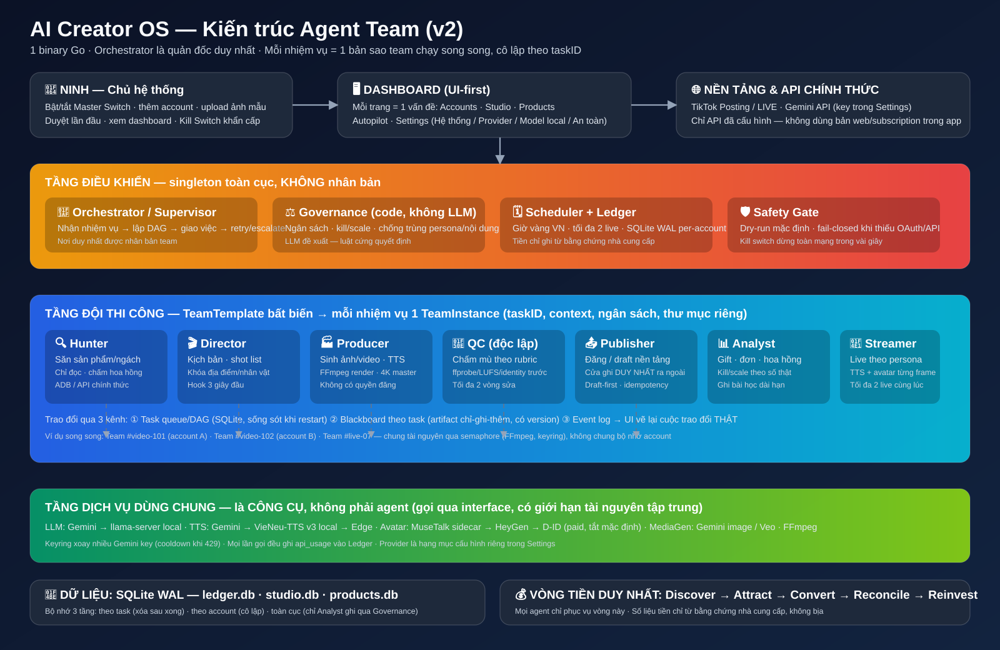

*Mỗi nhiệm vụ mới = một bản sao Agent Team chạy song song — xem mô phỏng trao đổi giữa các agent tại `docs/assets/agent-team-workflow.svg` và thiết kế đầy đủ tại `docs/AGENT_TEAM.md`.*
