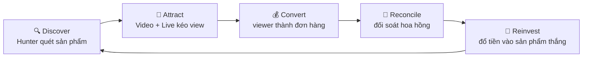
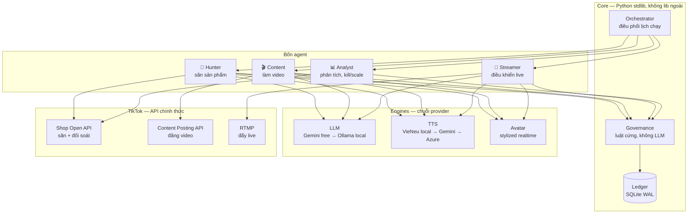
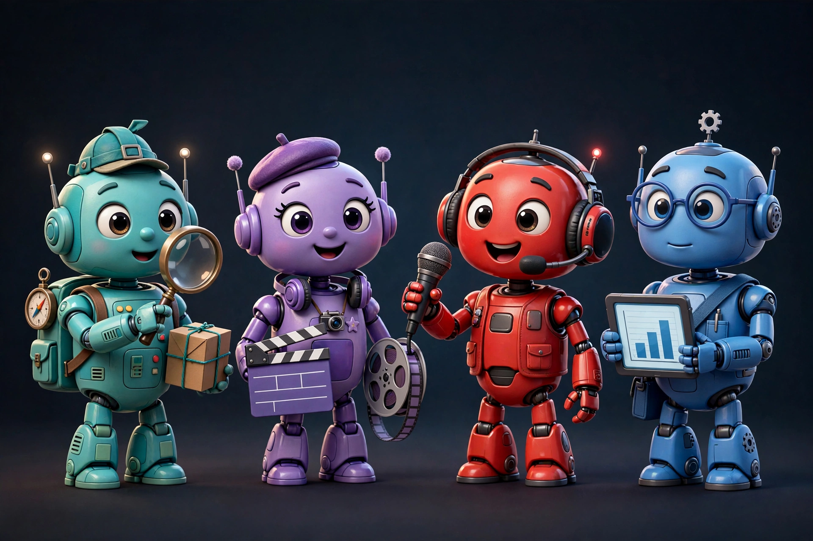
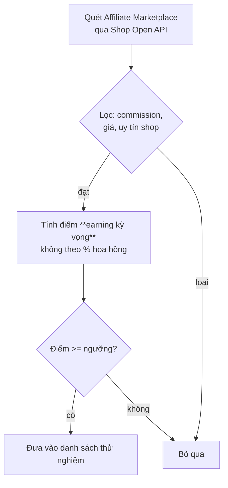
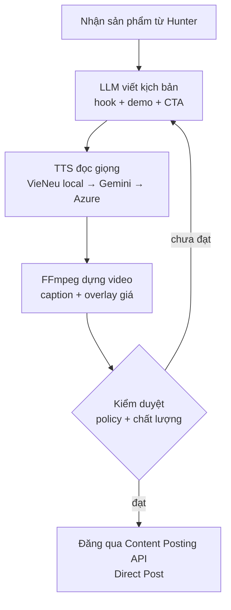
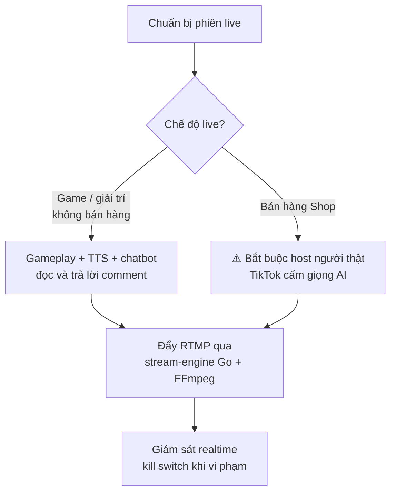
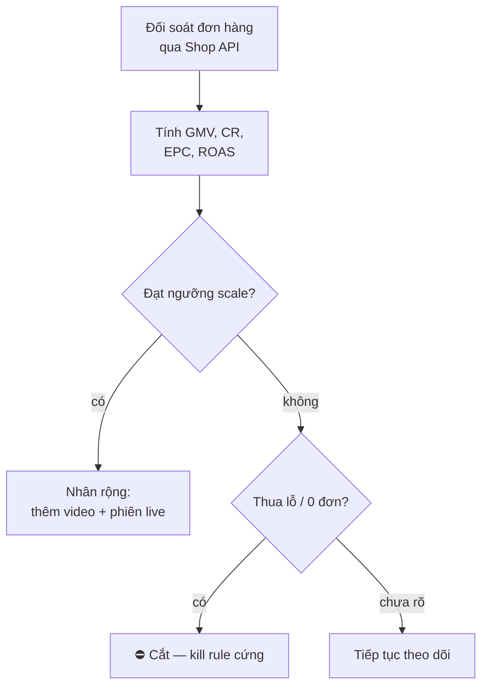
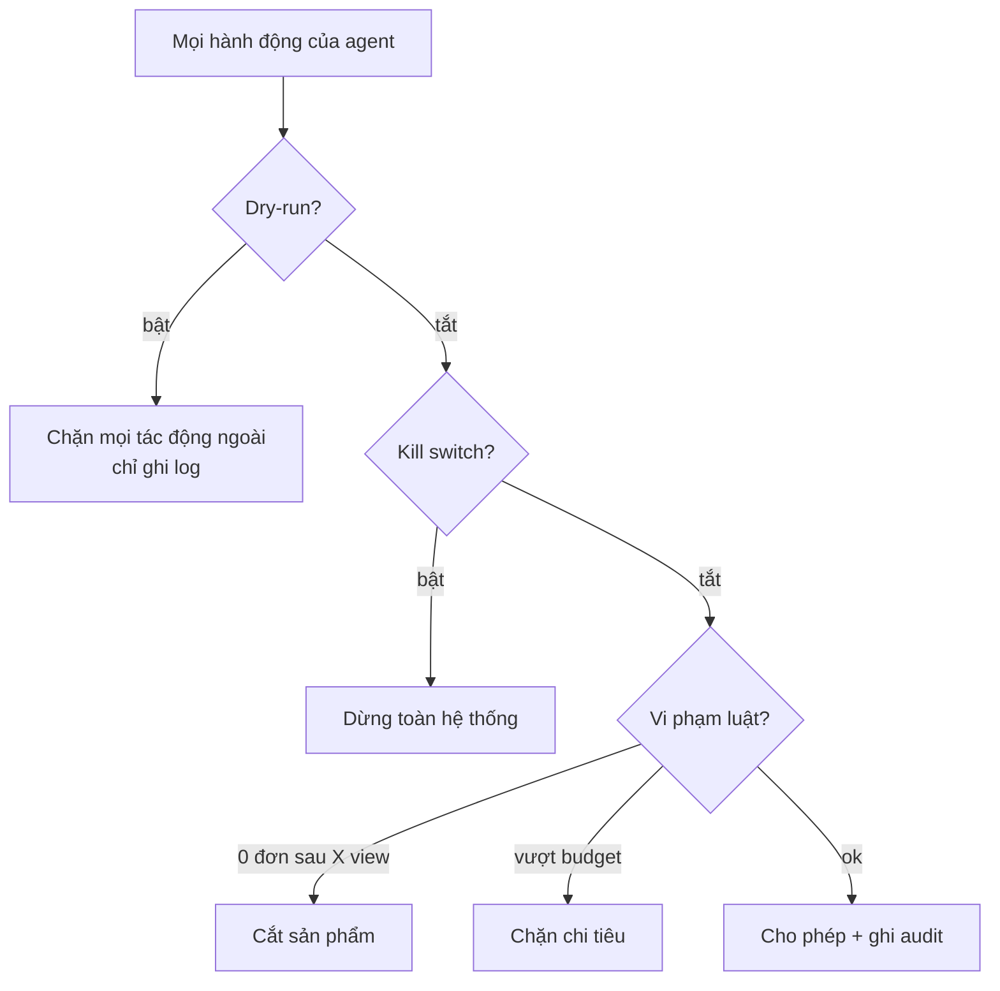
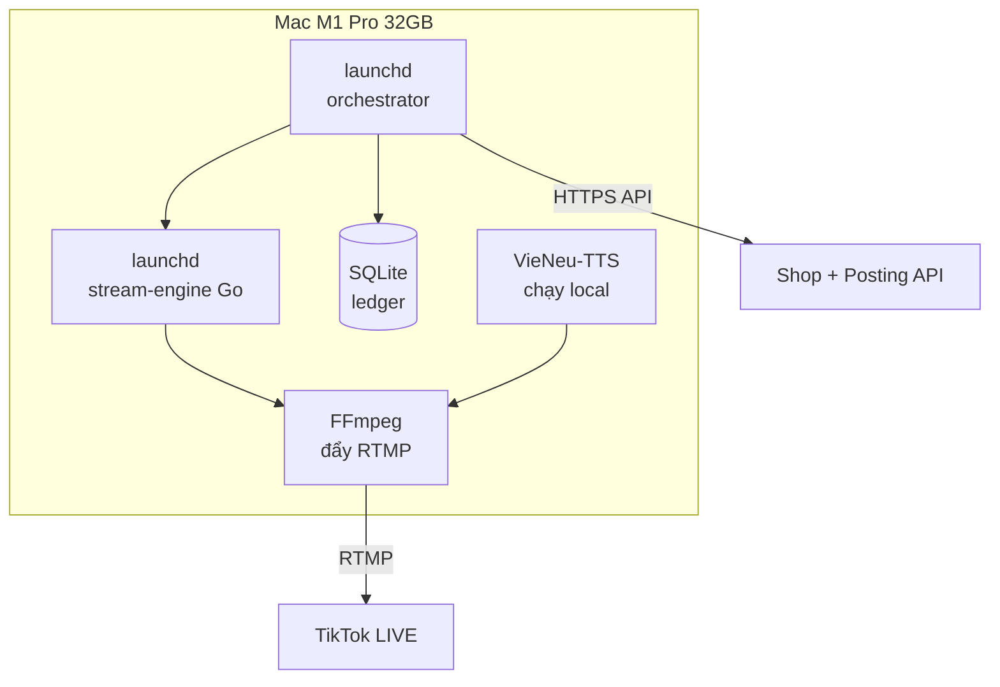

# TikTok Affiliate OS

**Hệ điều hành "công ty một người": đội AI tự vận hành vòng kinh doanh affiliate TikTok — săn sản phẩm → làm nội dung → livestream → đối soát hoa hồng → tái đầu tư.**


> 🖼️ **Ghi chú trung thực:** các ảnh và video trong README này là **concept minh họa do AI tạo**, giúp hình dung ý tưởng — không phải ảnh chụp sản phẩm thật. Sơ đồ kiến trúc (mermaid) mô tả đúng code hiện tại.

---

## 🎬 Xem nhanh

<video src="docs/assets/concept-teaser.mp4" controls width="100%"></video>

*Video concept: đội agent vận hành trung tâm điều khiển affiliate.*

### Dashboard điều khiển (mockup giao diện dự kiến)


*Mockup: GMV, đơn hàng, hoa hồng, phiên live đang chạy, trạng thái 4 agent và nút kill switch.*

---

## 💰 Vòng tiền — một vòng duy nhất



Mọi agent chỉ phục vụ một mục tiêu: **đồng hoa hồng quay vòng nhanh hơn, to hơn**.

---

## 🏗️ Kiến trúc tổng quan



**Nguyên tắc chọn công nghệ:** nhẹ, ít RAM/CPU/SSD → Python cho não, Go cho stream-engine, SQLite cho sổ cái. API miễn phí trước, local fallback sau, trả phí chỉ khi tùy chọn.



---

## 🤖 Từng agent làm gì

### 🎯 Hunter — thợ săn sản phẩm (`agents/hunter/agent.py`)



- Điểm khắt khe: sản phẩm 15% hoa hồng × bán chạy **thắng** sản phẩm 40% hoa hồng × ế.
- Dùng endpoint chính thức `Creator Search Open Collaboration Product` (sort theo commission, units_sold).

### 🎬 Content — xưởng video (`agents/content/agent.py`)



- Đăng hands-free sau khi app qua audit TikTok (~1 tháng). Giới hạn ~15 video/ngày.

### 📡 Streamer — đạo diễn live (`agents/streamer/agent.py`)




*Concept: live có host người + AI điều khiển overlay, ánh sáng, analytics.*

> ⚠️ **Phát hiện policy quan trọng (10/2026):** TikTok Shop cấm giọng AI, audio thu sẵn và avatar hoạt hình >50% màn hình trong **livestream bán hàng**. Live game/giải trí không dùng tính năng Shop nằm ngoài phạm vi cấm này. Chi tiết: `docs/RESEARCH/tiktok_live_policy.md`.

### 📊 Analyst — kế toán lạnh lùng (`agents/analyst/agent.py`)



- Kill rule không cảm xúc: 0 đơn sau X view/phiên live là cắt, không tranh cãi.
- Số liệu chỉ ghi từ API TikTok — **không bao giờ tự bịa doanh thu**.

---

## 🛡️ Governance — luật cứng, không phải lời khuyên



- Governance **không chứa LLM** — toàn bộ là code xác định, test được.
- Sổ cái append-only: tiền vào/ra đều có chứng từ.

---

## 🖥️ Chạy trên Mac của bạn



- Hai service `launchd` tự chạy khi mở máy, tự khởi động lại khi sập.
- Stream-engine giới hạn tài nguyên, tự reconnect khi rớt mạng.

---

## 🧪 Demo thử (rehearsal offline)

```bash
make rehearse   # chạy toàn bộ vòng tiền với dữ liệu giả, không chạm TikTok thật
```

Video demo thật sẽ được quay lại sau khi chạy rehearsal trên máy bạn.

---

## 📌 Trạng thái thật của dự án (v0.1)

| Phần | Trạng thái |
|---|---|
| Kiến trúc, 4 agent, governance, ledger, stream-engine | ✅ Code xong, test governance pass |
| Research API TikTok Shop / LIVE policy / TTS+avatar | ✅ Xong, trong `docs/RESEARCH/` |
| Wire provider thật (TTS, Shop API, Posting API) | ⏳ Chờ quyết định hướng đi |
| Streamer live | ⚠️ Chờ quyết định sau phát hiện policy TikTok |

**Các hướng đang cân nhắc:** A) thuê host người + AI làm còn lại · B) chỉ làm video ngắn AI · C) live full-AI chấp nhận rủi ro · D) **live game không lộ mặt** (AI voice + chatbot, không bán hàng trong live) + bán qua video ngắn.

📄 Tài liệu chi tiết: `docs/ARCHITECTURE.md` · `docs/OPERATIONS.md` · `docs/POLICY_AND_SAFETY.md`
