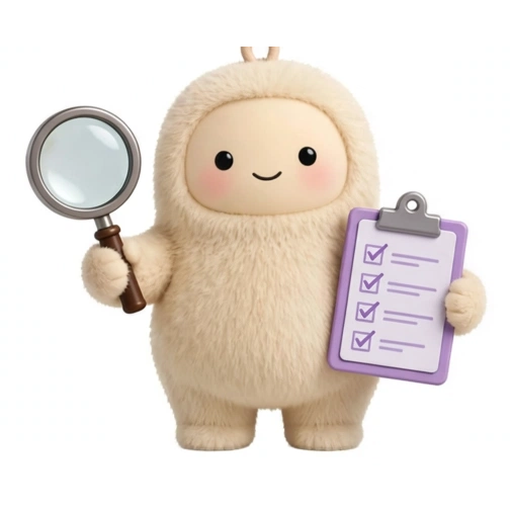
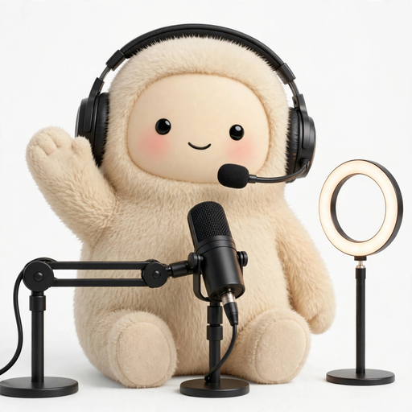

# AGENT_TEAM.md — Thiết kế Agent Team chuyên sâu cho AI Creator OS

> Tài liệu thiết kế chốt ngày 2026-10-02, theo yêu cầu của Ninh: toàn bộ hệ
> thống auto phải vận hành như **một đội agent chuyên sâu** — mỗi agent làm
> vượt phần việc của mình bằng năng lực chuyên môn sâu, và **mỗi nhiệm vụ mới
> thì nhân bản cả đội** thành một bản sao giống hệt để làm việc song song.
>
> Khi mâu thuẫn: `docs/MODEL.md` thắng về mô hình kinh doanh,
> `docs/ARCHITECTURE.md` thắng về kỹ thuật thực thi hiện tại, file này thắng
> về tổ chức đội agent.

Hình minh họa:

- Sơ đồ kiến trúc tổng: [`docs/assets/architecture-agent-team.svg`](assets/architecture-agent-team.svg)
- Mô phỏng agent trao đổi trong một nhiệm vụ: [`docs/assets/agent-team-workflow.svg`](assets/agent-team-workflow.svg)

---

## 1. Nguyên tắc gốc (không thương lượng)

1. **"Agent" = vai trò + danh sách công cụ được phép dùng + phạm vi trạng thái.**
   Không phải một tiến trình tự trị riêng, không phải một chatbot tự do.
2. **Một quản đốc duy nhất.** Chỉ Orchestrator được tạo team, giao việc, hủy
   việc. Agent không tự sinh agent con đệ quy.
3. **Luật cứng bằng code, không bằng prompt.** Governance không chứa LLM.
   LLM đề xuất — code quyết định, nhất là với tiền và an toàn tài khoản.
4. **Một binary Go, chạy trên một máy M1.** Không Kafka, không Redis, không
   microservice, không vector DB. Hàng đợi và bảng đen nằm trong SQLite sẵn có.
5. **Chỉ dùng API chính thức đã cấu hình trong Settings.** Không dùng bản web
   (Gemini/ChatGPT/Claude web) hay subscription cá nhân làm backend trong app.
   Nhà cung cấp mới chỉ vào hệ thống bằng API key chính thức, khai báo ở đúng
   một nơi: Settings → Nhà cung cấp.
6. **Agent chỉ làm việc thuộc hệ sinh thái của dự án này** (AI Creator
   Network: TikTok/Facebook/YouTube creator, affiliate, livestream, phim AI).
   Ngoài phạm vi đó: từ chối và báo lại Orchestrator.

## 2. Tổ chức đội: 3 tầng

### 2.1 Tầng điều khiển — singleton toàn cục, KHÔNG nhân bản

| Vai trò | Trách nhiệm duy nhất | Quyền đặc biệt |
|---|---|---|
| **Orchestrator / Supervisor** | Nhận nhiệm vụ, lập kế hoạch dạng DAG, giao việc, thu kết quả, retry/escalate, đóng nhiệm vụ | Nơi duy nhất được nhân bản team |
| **Governance** | Ngân sách, kill/scale, chống trùng persona/nội dung giữa các account, cổng duyệt lần đầu | Chặn được mọi agent, kể cả Orchestrator |
| **Scheduler** | Xếp giờ vàng VN, tối đa 2 live đồng thời, nghỉ tuần theo account | — |
| **Ledger** | Sổ cái SQLite WAL: tiền, quyết định, usage — append-only với tiền | Nguồn sự thật duy nhất về tiền |

### 2.2 Tầng đội thi công — được nhân bản theo mỗi nhiệm vụ

| Agent | Việc chuyên sâu của nó | Được dùng | TUYỆT ĐỐI không |
|---|---|---|---|
| **Hunter** | Săn sản phẩm/ngách theo theme của account; chấm điểm `hoa hồng × chuyển đổi / cạnh tranh` | Đọc marketplace (API chính thức hoặc ADB trên máy Android), đọc ledger | Đăng bất cứ thứ gì; đổi theme của account |
| **Director** | Viết kịch bản, shot list điện ảnh; khóa địa điểm, khóa nhân vật (character bible), hook 3 giây | LLM chain, thư viện ảnh mẫu của account | Gọi render; tự ý đổi sản phẩm đã được duyệt |
| **Producer** | Sinh ảnh/video, TTS, dựng FFmpeg (beat-bounce, 4K master, −14 LUFS) | MediaGen/TTS/Avatar chains, FFmpeg | Đăng bài; sửa kịch bản ngoài phần QC yêu cầu |
| **QC** | Kiểm chất lượng độc lập (xem §4) | Đọc artifact, ffprobe, rubric chấm điểm | Sửa artifact; đăng bài; nhìn thấy lý luận của Producer |
| **Publisher** | Đăng/draft lên nền tảng, draft-first, idempotency key theo task | Posting API, RTMP | Sửa nội dung; đăng khi chưa qua QC + Governance |
| **Analyst** | Đối soát gift/đơn/hoa hồng (chỉ số từ nhà cung cấp), đề xuất kill/scale, ghi bài học | Đọc ledger, API đối soát | Tự tiêu tiền; tự scale (phải qua Governance) |
| **Streamer** | Điều khiển buổi live theo persona: đạo diễn segment → TTS → avatar → RTMP | Stream engine, avatar/TTS chain | Live ngoài lịch Scheduler; tắt disclosure AI |

### 2.3 Tầng dịch vụ dùng chung — là CÔNG CỤ, không phải agent

LLM chain (Gemini → llama-server local), TTS chain (Gemini → VieNeu-TTS v3
local → Edge), Avatar chain (MuseTalk sidecar → HeyGen → D-ID, paid tắt mặc
định), MediaGen (Gemini image/Veo), FFmpeg.

Chúng không có "ý chí": agent gọi qua interface, mọi lần gọi ghi `api_usage`
vào Ledger, và tài nguyên khan hiếm (FFmpeg, GPU, key Gemini) đi qua
semaphore/keyring tập trung.

## 2b. Avatar của từng agent và persona (chốt 2026-10-02)

Mỗi agent và mỗi persona đều có avatar riêng, đúng chất "người nhà" của
Milo (linh vật lông xù màu kem, mắt đen hạt, má hồng) nhưng khác trang phục
và đạo cụ theo đúng công việc — nhìn avatar là biết vai trò, không cần đọc
chữ. File gốc nằm ở `docs/assets/agents/` (từng avatar riêng + 2 bản lưới
tổng). Đây là bộ mặt dùng cho dashboard, tài liệu và UI mô phỏng quá trình
làm việc; không dùng làm ảnh mẫu identity-lock cho video (việc đó vẫn theo
ảnh Ninh upload, xem §2 của GOAL).

**Đội agent:**

| Avatar | Vai trò | Nhận diện |
|---|---|---|
|  | Orchestrator | Tai nghe vàng + đũa chỉ huy — điều phối cả đội |
|  | Governance | Cân công lý + khiên đỏ — luật cứng, chặn/không chặn |
|  | Scheduler | Lịch + đồng hồ — giữ giờ vàng, tối đa 2 live |
|  | Hunter | Kính lúp + túi mua sắm — săn sản phẩm hoa hồng cao |
|  | Director | Clapperboard — viết kịch bản, shot list |
|  | Producer | Máy quay tím + tai nghe — sản xuất, render |
|  | QC | Kính lúp to + checklist — chấm mù, gác cổng chất lượng |
|  | Publisher | Hộp "tải lên" + máy bay giấy — cửa đăng duy nhất |
|  | Analyst | Tablet biểu đồ + đồng xu — đối soát tiền, kill/scale |
|  | Streamer | Tai nghe mic + ring light — lên sóng live |

**Persona (nhân vật mỗi account đóng):**

| Avatar | Persona | Nhận diện |
|---|---|---|
|  | Storyteller | Sách truyện + đèn lồng — kể chuyện đêm khuya |
|  | AI Teacher | Kính + sách + que chỉ — dạy tiếng Anh qua truyện |
|  | AI Musician | Micro + guitar — hát nhạc tự sáng tác |
|  | Game Master | Tai nghe gaming + tay cầm — chơi game được phép |
|  | AI Coder | Hoodie + laptop code — live code theo yêu cầu viewer |
|  | Dancer | Điệu nhảy + nốt nhạc — bắt trend (phase sau) |

Quy ước dùng: avatar agent chỉ xuất hiện cạnh đúng vai trò đó trong UI/log
(ví dụ event của QC thì hiện avatar QC). Khi một TeamInstance được nhân bản,
cả đội dùng chung bộ avatar này — bản sao khác nhau ở taskID và dữ liệu,
không khác mặt.

## 3. Cơ chế nhân bản team cho mỗi nhiệm vụ mới

Đây là phần Ninh yêu cầu cốt lõi: *mỗi nhiệm vụ mới → tạo một bản sao giống y
hệt bản gốc gồm đủ agent member → chạy song song với các team khác.*

Cài đặt trong Go (single binary):

1. **TeamTemplate (bất biến, định nghĩa trong code):** với mỗi vai trò —
   prompt vai trò, danh sách công cụ được phép, ngân sách (token, thời gian,
   số vòng sửa tối đa), rubric riêng. Template không đổi theo nhiệm vụ.
2. **TeamInstance (một nhiệm vụ = một instance):**
   - `taskID` duy nhất; `context.WithCancel/WithTimeout` riêng — hủy là hủy
     sạch cả team, không goroutine mồ côi (`errgroup.WithContext`).
   - **Blackboard riêng** theo task: kho artifact chỉ-ghi-thêm, có version
     (kịch bản → storyboard → media → điểm QC → bản sửa).
   - Thư mục làm việc riêng `data/tasks/<taskID>/`, có TTL dọn dẹp.
   - Hạt giống (seed) riêng: persona + sản phẩm + ảnh mẫu của đúng account đó.
3. **Chia sẻ có kiểm soát:** chỉ dùng chung tài nguyên đọc hoặc có khóa —
   config, keyring Gemini, semaphore (tối đa N render FFmpeg đồng thời, tối
   đa 2 live). **Không chia sẻ bộ nhớ account giữa các team của account khác**
   (chống trùng nội dung và phạt chéo).
4. **Trần song song cố định:** worker pool theo loại tài nguyên, không spawn
   goroutine vô hạn theo số account. Độ sâu nhân bản tối đa 1 tầng.
5. **Vòng đời:** tạo → lập DAG → chạy theo đợt (fan-out các shot độc lập) →
   QC → Governance mở cổng → Publisher → Analyst học → đóng + lưu trace.

Ví dụ thực tế cùng một thời điểm: Team `#video-101` làm video cho account A,
Team `#video-102` cho account B, Team `#live-07` đang live — ba bản sao của
cùng một đội, không đội nào thấy bộ nhớ của đội nào.

## 4. Cách các agent trao đổi (3 kênh, mỗi kênh một việc)

Agent **không chat tự do ngang hàng** — đó là nguồn vòng lặp vô hạn và nổ chi
phí token. Mọi trao đổi đi qua cấu trúc:

1. **Task Queue / DAG (kênh chính):** Orchestrator giao việc dạng job có kiểu
   dữ liệu rõ ràng, trạng thái lưu xuống SQLite — tắt/mở app vẫn tiếp tục
   được, việc nào xong việc nào chưa nhìn là thấy.
2. **Blackboard theo task (kênh dữ liệu):** agent đọc/ghi artifact có version
   thay vì gửi tin nhắn cho nhau. Mọi artifact ghi rõ agent nguồn và artifact
   cha → truy vết được toàn bộ quá trình.
3. **Event Log (kênh hiển thị):** tiến độ, quyết định, điểm QC phát thành sự
   kiện. UI "mô phỏng các agent trao đổi" vẽ lại **từ event log thật này**,
   không dựng đoạn chat giả. Xem hình mô phỏng:
   [`docs/assets/agent-team-workflow.svg`](assets/agent-team-workflow.svg).

## 5. Kiểm soát chất lượng: 3 lớp, rẻ trước đắt sau

1. **Kiểm tra xác định (0 token, chạy trước):** ffprobe đúng 1080×1920/30fps,
   loudness −14 LUFS, khung đen, identity hash khớp ảnh mẫu, file tồn tại.
   Sai ở đây là chặn ngay, không tốn một lần gọi LLM nào.
2. **Critic độc lập (chấm mù):** QC dùng vai trò khác và **không nhìn thấy lý
   luận của Producer** — tự chấm mình có điểm mù đã biết; người khác chấm mới
   bắt được lỗi. Chấm theo rubric có cấu trúc (hook 3s, đúng sản phẩm, tay
   không lỗi, nhất quán địa điểm, mặt giống mẫu...), mỗi tiêu chí kèm lý do cụ
   thể để Producer chỉ sửa đúng chỗ hỏng. **Tối đa 2 vòng sửa**, sau đó leo
   thang Governance/Ninh.
   *Lưu ý trung thực:* Producer và QC cùng chạy một model thì vẫn có điểm mù
   chung — lớp 1 và cổng người duyệt lần đầu mỗi persona là để bù điểm này.
3. **Tranh biện (chỉ nơi giá trị cao):** chọn sản phẩm thắng, chốt kịch bản
   phim — 2 đề xuất độc lập + 1 judge, 1 vòng, bỏ phiếu mù. Không dùng cho
   từng khung hình: chi phí gấp ~3 lần phải tự xứng đáng.

**Cổng người:** lần đăng đầu tiên của mỗi persona/account phải qua Ninh
duyệt. Sau khi được duyệt, luật chạy tự động.

## 6. Bộ nhớ 3 tầng

| Tầng | Chứa gì | Ai đọc / ai ghi | Tuổi thọ |
|---|---|---|---|
| Làm việc (per-task) | Blackboard của nhiệm vụ | Team của task đó | Xóa sau khi xong, chỉ giữ tóm tắt |
| Theo account (episodic) | Persona bible, lịch sử sản phẩm, hiệu quả từng video | Team của đúng account đó | Dài hạn, **cô lập giữa các account** |
| Toàn cục (semantic) | Nhạc trending, chính sách nền tảng, bài học chung | Mọi agent đọc; chỉ Analyst ghi, qua Governance duyệt | Dài hạn |

## 7. Ngân sách và điểm dừng (chống "làm mãi không xong")

Mỗi TeamInstance có ngân sách cứng trong TeamTemplate: trần token, trần thời
gian, trần số vòng sửa QC (2), trần số lần retry mỗi job (3, backoff). Vượt
bất kỳ trần nào → dừng, ghi quyết định vào Ledger, báo Dashboard. "Làm việc
vượt mức" nghĩa là làm sâu trong ngân sách, không phải đốt vô hạn.

Kill switch toàn mạng và kill theo task luôn thắng mọi ngân sách.

## 8. Ánh xạ về code hiện tại (trung thực, 2026-10-02)

| Thiết kế này | Code hiện tại | Trạng thái |
|---|---|---|
| Orchestrator | `internal/network` (Daemon) + `internal/studio` (autopilot) | Có khung; daemon production chưa nối callback live/agent — xem ARCHITECTURE §12 |
| Governance | `internal/agents/governance` | Xong, thuần hàm, có test |
| Hunter | `internal/agents/hunter` + `internal/affiliatehunter` (ADB) | Agent có; hunter ADB chưa cắm vào products/UI |
| Director / Producer | `internal/studio` (director, mediagen, assemble) | Phần hoàn thiện nhất |
| QC | Rải rác: upscale/assemble test, review UI storyboard | Chưa thành agent QC độc lập chấm mù — việc cần làm tiếp |
| Publisher | `internal/publishers` + `internal/tiktok` | Draft-first xong; Shop API fail-closed có chủ đích |
| Analyst | `internal/agents/analyst` | Đã khôi phục luật kill theo phiên live (2026-10-02) |
| Streamer | `internal/agents/streamer` + `internal/stream` | Logic có; engine còn phát test pattern — chưa live thật |
| Dịch vụ dùng chung | `internal/engines` (llm/tts/avatar/local) | Xong; paid avatar tier còn khung |
| TeamInstance/blackboard | `internal/studio` job + SQLite `studio.db` | Là hạt nhân sẵn có để nâng thành blackboard theo task |

## 9. Những gì KHÔNG làm (và vì sao)

- Không agent chat tự do không giới hạn (vòng lặp, nổ token, không tái lập được).
- Không agent tự sinh agent con ngoài cơ chế nhân bản của Orchestrator.
- Không thêm hạ tầng ngoài binary (message broker, vector DB, microservice).
- Không biến Governance thành LLM; không cấp mọi công cụ cho mọi agent —
  thực thi bằng allowlist ở tầng code, không bằng lời dặn trong prompt.
- Không tranh biện khắp nơi; chỉ nơi kiểm chứng dễ hơn tạo và giá trị cao.
- Không giữ blackboard/log mãi mãi — phải có TTL, nếu không đĩa và SQLite
  phình trong vận hành dài hạn.
