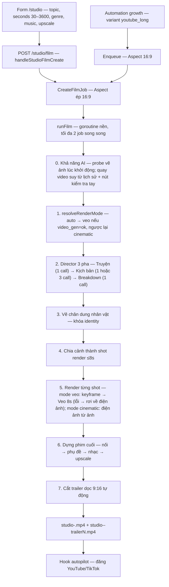
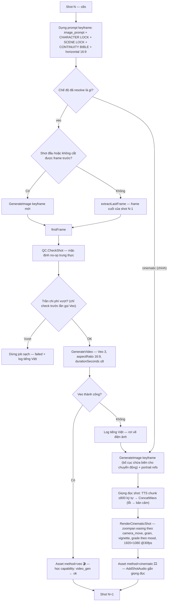
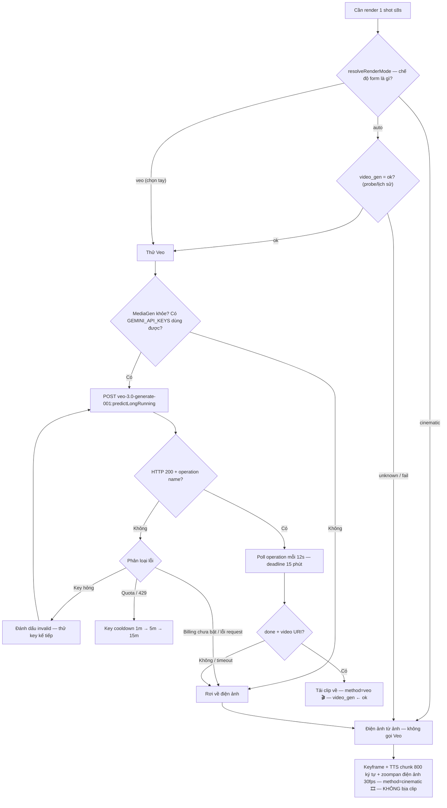
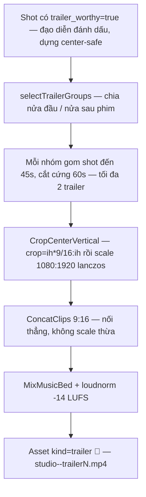

# Studio Phim — Tài liệu kỹ thuật chi tiết

> Đọc code thật tại `internal/studio/` (branch main, HEAD `ffffa0a` — Film Wave 3).
> Tài liệu này mô tả **đúng logic đang chạy**, không mô tả ý định tương lai.
> Luật bất di bất dịch của pipeline nằm ở [`FILM_RULES.md`](FILM_RULES.md).

## 0. Tổng quan

Studio Phim biến một **chủ đề** thành **file phim hoàn chỉnh** (video + phụ đề
tiếng Việt + nhạc nền + trailer dọc) mà không cần người dựng.

**Chế độ dựng** (`FilmParams.RenderMode`, `internal/studio/cinematic.go` —
Wave 3 đổi "điện ảnh từ ảnh" thành chế độ chính vì key Gemini của Ninh không
quay được video):

| Chế độ | Hành vi | Chi phí |
|---|---|---|
| `auto` (mặc định, khuyên dùng) | `video_gen = ok` → thử Veo từng shot; unknown/fail → **đi thẳng điện ảnh từ ảnh, không thử Veo** | theo nhánh |
| `cinematic` | Luôn dựng điện ảnh từ ảnh | ≈ $0 (chỉ tốn image gen) |
| `veo` | Luôn thử Veo từng shot; lỗi → rơi về điện ảnh, không fail job | ~$0.05/s (ước tính chưa kiểm chứng) |

**Director 3 pha** — quy tắc bất di bất dịch: *"truyện → kịch bản → breakdown →
storyboard → quay → dựng"* (`internal/studio/director.go`):

| Pha | Prompt | Số lần gọi LLM | Đầu ra |
|---|---|---|---|
| 0. Truyện | `story.txt` | 1 | Truyện ngắn/tiểu thuyết mini hoàn chỉnh (~2 từ/giây phim, kẹp 300–6000 từ) — "linh hồn" |
| 1. Kịch bản | `screenplay.txt` (phim ≤180s) hoặc `film_act1/2/3.txt` (phim dài) | 1 hoặc 3 (theo hồi) | Action + thoại là CHUẨN, chưa có character sheet/shot list |
| 2. Breakdown | `breakdown.txt` | 1 | Character bible (thiết kế lý giải từ kịch bản) + khóa bối cảnh + continuity + shot list |

`script.json` trong thư mục job là `FilmScriptBundle {story, screenplay,
breakdown, script}` — storyboard UI xem lại từng pha; job Wave 1–2 chỉ có
`FilmScriptPro` vẫn đọc được (tương thích ngược).

Thông số cố định của mọi phim:

- **Khung hình: 16:9** — `CreateFilmJob` ép cứng `Aspect = "16:9"`, form không
  có nút chọn khổ (quyết định của Ninh 2026-10-02, chốt cuối).
- **Độ phân giải: 1920×1080** (`AspectDims("16:9")`).
- **30 fps** (`filmFPS = 30` trong `internal/engines/film.go`) — không 60fps
  theo yêu cầu của Ninh.
- **Đơn vị render thật: 1 shot = tối đa 8 giây = đúng 1 lần gọi Veo 3.**
  Cảnh chỉ là nhóm shot để kịch bản dễ đọc.
- Tối đa **2 job Studio chạy đồng thời** (`maxConcurrentStudioJobs = 2`,
  dùng chung với job affiliate).

Trạng thái job/assets lưu trong `studio.db` (2 bảng `studio_jobs`,
`studio_assets`); kịch bản đã viết được cache thành `script.json` trong
thư mục làm việc của job để resume không viết lại.

## 1. Sơ đồ tổng quan pipeline

## 2. Luồng `runFilm` ở tầng shot

> Đường `cinematic` là chế độ chính (Wave 3): không tốn Veo, không check trần
> chi phí. Đường `veo` chỉ chạy khi `auto` resolve ra `veo` (video_gen=ok)
> hoặc người dùng chọn tay `veo`.

## 3. Cây quyết định chế độ dựng + Veo (fail-closed)

Nguyên tắc: **không bao giờ có clip giả.** `auto` không bao giờ thử Veo khi
video_gen unknown/fail (không tốn phút poll API chết). Veo lỗi vì bất kỳ lý
do gì thì shot đó dựng bằng điện ảnh từ ảnh + giọng đọc, và log + badge trên
storyboard ghi rõ shot đó render bằng gì.

### 3b. Bảng capability probe (Wave 3 — `internal/studio/capabilities.go`)

| Khả năng | Cách xác định | Khi nào | Ghi ở đâu |
|---|---|---|---|
| Vẽ ảnh (`image_gen`) | `ProbeImageGen`: vẽ thử 1 ảnh đơn giản | Lúc khởi động app (goroutine, timeout 3 phút) | ok/fail + thời điểm + chi tiết lỗi |
| Quay video (`video_gen`) | `RefreshVideoStatusFromHistory`: suy từ 30 shot gần nhất | Lúc khởi động app | ok / fail / unknown ("chưa kiểm tra") |
| Quay video (tay) | `ProbeVideoGen`: quay thử đúng 1 clip 8s Veo | Nút "Kiểm tra quay video" ở Cài đặt → Model local (modal cảnh báo TỐN ~8s Veo tiền thật) | Thắng mọi suy luận lịch sử |

Lịch sử chỉ ghi khi status còn `unknown` — probe tay luôn thắng. Bảng
`capabilities` nằm trong `studio.db`; UI Cài đặt → Model local hiện badge
ok/fail/chưa kiểm tra + thời điểm kiểm tra.

## 4. Luồng trailer tự động (Shorts/TikTok)

- Không có shot nào được đánh dấu → bỏ qua, không lỗi, log rõ.
- Trailer là **sản phẩm duy nhất** cho Shorts/TikTok — không sản xuất video
  ngắn riêng (quyết định của Ninh 2026-10-02).

## 5. Chi tiết từng khâu

### 5.1. Nhận yêu cầu — 2 đường vào

1. **Thủ công:** form tab "Phim" ở `/studio` → `POST /studio/film`
   (`handleStudioFilmCreate`, `internal/web/studio.go:266`):
   - `topic` (bắt buộc, trống → `?err=`), `seconds` (30–3600, mặc định 90),
     `genre` (7 lựa chọn: Tâm lý, Tình cảm, Hành động, Kinh dị, Hài,
     Khoa học viễn tưởng, Tài liệu; mặc định Tâm lý),
     `render_mode` (select: `auto` mặc định khuyên dùng / `cinematic` miễn
     phí / `veo` tốn phí — validate server-side, giá trị lạ → `auto`),
     `music_file` (tùy chọn, mp3/m4a/wav/ogg ≤60MB),
     `upscale_final` (checkbox, nhãn trung thực "lanczos — không phải
     4K native").
   - Form hiện **ước tính chi phí + ETA theo chế độ** (`filmEstimate`, mode-aware)
     trước khi bấm: `cinematic` → "Điện ảnh từ ảnh: ≈ $0 — chỉ tốn image gen
     (rẻ), không dùng Veo"; `veo` → `≈ N shot × 8s Veo × $rate/s ≈ $X ·
     render ~Y phút` (mọi nơi đều ghi "ước tính chưa kiểm chứng").
     Server render sẵn cho 90s; JavaScript cập nhật theo đúng số giây người
     dùng nhập (`Math.ceil(s/8)` shot, `shots*3` phút).
2. **Tự động:** growth plan → `studioGrowthProducer.Enqueue`
   (`internal/web/growth_produce.go:58`) truyền `Aspect` từ
   `VariantAspect("youtube_long") = "16:9"`.

Cả hai đường đều qua `CreateFilmJob` (`internal/studio/studio.go:711`):
ép `Aspect = "16:9"`, `Seconds ≤ 0 → 90`, rồi chạy `runFilm` trong goroutine
nền (giới hạn 2 job đồng thời qua `jobSlot()`).

### 5.2. Director 3 pha — truyện → kịch bản → breakdown

`WriteFilmScriptBundle` (`internal/studio/director.go`) — LLM chain
(Gemini → llama-server local → paid-disabled). Quy tắc bất di bất dịch:
**"truyện → kịch bản → breakdown → storyboard → quay → dựng"**.

**Pha 0 — Truyện** (`prompts/story.txt`, 1 lần gọi): LLM viết truyện ngắn /
tiểu thuyết mini HOÀN CHỈNH — văn xuôi giàu chi tiết giác quan "máy quay nhìn
thấy được", nhân vật có tên Việt Nam cụ thể, đối thoại tự nhiên, cấu trúc 3
hồi (hook đầu, bước ngoặt giữa, cao trào + kết). Độ dài ~2 từ/giây phim, kẹp
300–6000 từ (`storyWords`). Đây là "linh hồn" — pha 1 chuyển thể nó.

**Pha 1 — Kịch bản** (action + thoại là CHUẨN, chưa có character sheet hay
shot list):

- **Phim ngắn (≤180s):** 1 lần gọi, prompt `prompts/screenplay.txt`,
  `n = seconds/20` cảnh (kẹp 2–6), cấu trúc 3 hồi thu nhỏ — hook trong
  **15s đầu**.
- **Phim dài (>180s):** 3 lần gọi, prompt `film_act1/2/3.txt`: hồi 1 (20%
  thời lượng), hồi 2 (55%), hồi 3 (25%) — hook 60s đầu, bước ngoặt giữa,
  cao trào + kết. Mỗi hồi 3–10 cảnh (`n = actSecs/120`, kẹp 3–10). **Không
  dựng character bible ở hồi 1** (việc của pha 2); dàn nhân vật hồi sau được
  trích XÁC ĐỊNH từ tên trong thoại hồi trước (`screenplayCast`) để giữ đúng
  tên mà không phụ thuộc LLM.

**Pha 2 — Breakdown** (`prompts/breakdown.txt`, 1 lần gọi): LLM đọc toàn bộ
kịch bản pha 1 và trích xuất yếu tố sản xuất — character bible (ngoại hình /
trang phục **PHẢI lý giải từ nhu cầu kịch bản**, có `design_note` — vd "váy
vàng cảnh 4 = sự hồi sinh"), khóa bối cảnh (có thể chau chuốt từ pha 1),
continuity bible, đạo cụ (`props`), shot list từng cảnh (shot_size,
camera_move, lens_light, action CỤ THỂ, image_prompt, trailer_worthy).

`assembleScript` ráp 2 pha thành `FilmScriptPro`: **action / thoại / lời dẫn
của pha 1 là CHUẨN (pha 2 không được viết lại)**; character bible + khóa bối
cảnh + continuity + shot list lấy từ pha 2. Thiếu breakdown của bất kỳ cảnh
nào, hoặc cảnh không có shot → **lỗi fail-closed** (không quay cảnh không có
shot).

Prompt đạo diễn sống trong **file text versioned**
(`internal/studio/prompts/*.txt`, nhúng bằng `go:embed`, render qua
`text/template`) — chỉnh tay nghề đạo diễn không cần sửa code.
`film_short.txt` đã XOÁ ở Wave 3 (thay bằng `story.txt` + `screenplay.txt` +
`breakdown.txt`).

Kịch bản ráp xong (`FilmScriptPro`) gồm:

| Trường | Nội dung | Ngôn ngữ |
|---|---|---|
| `characters[]` | name + `appearance` (tuổi, mặt, tóc, da, dáng — CHI TIẾT) + `wardrobe` + `design_note` (lý giải từ kịch bản) | tiếng Anh |
| `scenes[].location/time_of_day/atmosphere` | khóa cứng bối cảnh (pha 2 chốt, fallback pha 1) | tiếng Anh |
| `scenes[].continuity` | **continuity bible**: trang phục chi tiết từng nhân vật, tóc, đạo cụ, hướng sáng, thời tiết — viết 1 lần | tiếng Anh |
| `scenes[].props` | đạo cụ quan trọng của cảnh (pha 2 trích xuất) | tiếng Anh |
| `scenes[].shots[]` | `shot_size` (ECU/CU/MCU/MS/WS/EWS/drone), `camera_move`, `lens_light`, `seconds` (kẹp 2–10 sau sanitize), `action` (CỤ THỂ, cấm chung chung), `image_prompt`, `trailer_worthy` | action: tiếng Việt; prompt: tiếng Anh |
| `scenes[].dialogue[]` | `character`, `text`, `emotion` (cụ thể) | tiếng Việt |
| `scenes[].narration` | lời dẫn | tiếng Việt |

Luật bất di bất dịch trong prompt (vi phạm = kịch bản hỏng): hook đầu phim,
bước ngoặt giữa, cao trào + kết trọn; action cụ thể từng shot; center-safe
cho shot `trailer_worthy`; không lặp `shot_size`+`camera_move` quá 2 shot
liên tiếp; mỗi cảnh ≥1 wide, ≥1 close-up, ≥1 movement; **thoại trung thực**
(ưu tiên narration + thoại off-camera vì không có lip-sync — xem §8).

### 5.3. Chân dung nhân vật — identity lock

Trước khi quay, mỗi nhân vật được **vẽ chân dung một lần**
(`runFilm`, `internal/studio/studio.go`):

- Prompt: `Cinematic character portrait, <appearance>. Wardrobe: <wardrobe>.
  Photorealistic, vertical 9:16, neutral expression, plain background.`
- **Cố ý 9:16** — đây là ảnh tham chiếu identity, không phải khung hình xuất.
- Mỗi chân dung là 1 asset kind `"portrait"` (idx `1000+i`); lỗi → asset
  `failed` + log `⚠` cảnh báo trên UI (không `continue` chìm — P2-4).
- Ảnh chân dung được gửi làm **inlineData (base64, tối đa 12MB/ảnh)**
  trong **mọi** lần gọi `GenerateImage` keyframe (`charRefs`) — đây là cơ chế
  khóa khuôn mặt thật, không phải chữ trang trí.
- Đồng thời mọi prompt ảnh/video đều gắn nguyên văn 2 khối text:
  - `CHARACTER LOCK — <name>: <appearance>. Wardrobe: <wardrobe>. Keep the
    EXACT same face, hairstyle, age and identity in every shot.`
  - `SCENE LOCK — location: …; time: …; atmosphere/lighting: …. Every shot of
    this scene must show the SAME place, time and lighting.`

### 5.4. Chia cảnh thành shot render — `expandSceneShots`

`internal/studio/shots.go` — cảnh chỉ còn là nhóm shot:

- Thời lượng cảnh phân bổ theo **trọng số seconds của từng beat** đạo diễn
  viết; beat nào >8s thì chia nhỏ tiếp; phần dư làm tròn dồn vào beat cuối.
- Mỗi `RenderShot`: `Seq` (thứ tự toàn phim), `SceneIdx`, `Act`, `SubIdx`,
  `Seconds ≤ 8`, camera, `Action`, `ImagePrompt`, `VideoPrompt`,
  `Dialogue`, `Narration`, `TrailerWorthy`.
- Thoại + lời dẫn của **cảnh** được chia **vòng tròn** cho các shot — để phụ
  đề khớp đúng từng shot.
- Beat chia nhỏ (u>0) được gắn thêm `(continued shot, same framing,
  same action)` vào image prompt.
- Không có shot nào từ đạo diễn → fallback 1 beat WS/static dùng
  `sc.ImagePrompt`.

### 5.5. Render từng shot — `renderFilmShot` (hai chế độ)

(`internal/studio/studio.go`) Mỗi shot đi qua các bước sau, tùy chế độ đã
resolve (`renderMode` truyền từ `runFilm`):

**Bước chung — dựng prompt keyframe**: `image_prompt + CHARACTER LOCKs +
SCENE LOCK + CONTINUITY BIBLE (nguyên văn, "copy verbatim, do not
paraphrase") + "Cinematic photorealistic, horizontal 16:9, no text, no
watermark."`

**Chế độ `veo` — `tryVeoShot`** (chỉ khi `auto` resolve ra veo hoặc chọn tay):

1. **FirstFrame (frame-chain)**: shot đầu → `GenerateImage` keyframe mới;
   các shot sau → `extractLastFrame` (cắt frame cuối của clip shot trước
   bằng `ffmpeg -sseof -0.5`); cắt không được → vẽ keyframe mới.
2. **QC**: `s.QC.CheckShot(portrait, keyframe, "")` — mặc định là
   `NoopQCChecker` (**trung thực: chưa kiểm tra thật**; xem §8).
3. **Trần chi phí**: `budget.check(min(seconds, 8))` **trước** mỗi lần gọi
   Veo — vượt trần → job failed sạch + log tiếng Việt ("vượt trần chi phí
   API $X… Nâng trần ở Cài đặt · Hệ thống rồi bấm Chạy tiếp"). Không đặt
   trần → chạy nhưng log cảnh báo số tiền ước tính.
4. **Veo**: `GenerateVideo(vprompt, firstFrame, seconds, "16:9", mp4)` —
   `vprompt` gồm image_prompt + camera (`shot_size, camera_move, lens_light`)
   + orient + charLocks + scene lock + continuity bible + khối `PERFORMANCE`
   (action cụ thể, "do not improvise") + `FACIAL EXPRESSIONS / EMOTIONS` (từ
   emotion từng câu thoại). Thành công → `method="veo"` 🎬, cộng `spentSecs`,
   và **học capability**: `SetCapability(video_gen, ok, "shot N quay bằng
   Veo thành công")` — bằng chứng từ lần chạy thật.
5. **Veo lỗi** → log tiếng Việt ("Shot N: Veo lỗi (…) — dùng điện ảnh từ
   ảnh") → **rơi về điện ảnh từ ảnh**, không fail job.

**Chế độ `cinematic` — `renderCinematicShot` (CHẾ ĐỘ CHÍNH)**:

1. Keyframe: `keyPrompt + keyframeCompBlock()` (prompt `film_keyframe.txt`
   viết bố cục chừa biên cho chuyển động) — `GenerateImage` với portrait
   refs; lỗi → asset failed.
2. QC (no-op trung thực, như trên).
3. **Giọng đọc của shot**: thoại + lời dẫn → `splitTextChunks` (tách theo
   câu `. ! ?`, tối đa **800 ký tự/chunk**) → TTS từng chunk qua `Narrator`
   (chain Gemini → VieNeu local → Edge) → nối bằng `tts.ConcatWavs` (WAV
   PCM s16le 24kHz mono). Lỗi TTS → dựng **bản câm** (không fail job).
4. `RenderCinematicShot` (`internal/studio/cinematic.go`): keyframe →
   chuyển động điện ảnh **zoompan có easing theo đúng `camera_move` của đạo
   diễn** (không random; move lạ → slow breathing drift, không bao giờ đứng
   yên chết) → film grain nhẹ (`noise alls`) + vignette + grade màu theo
   mood (`Atmosphere` của cảnh) Output 1920×1080 @30fps (`cineFPS = 30`).
   Chuyển cảnh xfade 0.7s giữa các shot thực hiện ở bước dựng cuối (§5.6).
5. `AddShotAudio`: gắn giọng đọc (hoặc im lặng) vào video; thời lượng shot
   = max(giây kịch bản, giây audio TTS) → `method="cinematic"` 🎞.

Mỗi shot là 1 asset kind `"shot"` (idx = `Seq`), lưu prompt đầy đủ để
storyboard hiển thị.

### 5.6. Dựng phim cuối — `assembleFilmFinal` (rẽ nhánh theo chế độ)

**Chế độ `cinematic`** (`AssembleCinematic`, `internal/studio/cinematic.go`):

1. **Nối bằng xfade**: chuẩn hoá mọi shot về 1920×1080/30fps/stereo-48kHz
   (shot Veo 24fps có thể trộn với shot cinematic 30fps) rồi nối bằng
   **chuyển cảnh xfade 0.7s** (`cineXfadeDur`) — chuyển cảnh mượt thay vì cắt
   cứng.
2. **Letterbox 2.35:1** (`ApplyLetterbox`): viền điện ảnh trên dưới (~131px
   mỗi viền ở 1920×1080) — chỉ ở bản phim cuối (trailer cắt từ shot gốc nên
   không dính viền). Lỗi → log `⚠` và giữ bản không viền.
3. **Phụ đề theo timeline xfade** (`cinematicCues`): shot sau bắt đầu sớm
   hơn 0.7s nên cue phụ đề tính theo offset xfade → `MuxSubtitles` mux
   `mov_text`, tag `language=vie`, **không re-encode**.

**Chế độ `veo`** (đường nối cứng cũ):

1. **Nối**: `ConcatClips(clips, "16:9", ...)` — probe từng clip bằng ffprobe;
   clip nào sai khổ → `scale` + `pad` về đúng 1920×1080; clip không đọc
   được → **lỗi to** (không nối câm thành file hỏng). Dùng
   `h264_videotoolbox` (phần cứng Mac) nếu có, không thì `libx264 -crf 18`,
   `yuv420p`, AAC 160k.
2. **Phụ đề**: `engines.BuildSRT(subTexts, subDurs)` — 1 entry/shot, canh
   đúng thời lượng probe được của từng shot → `MuxSubtitles` mux `mov_text`,
   tag `language=vie`, **không re-encode**.
3. **Nhạc nền** (nếu có `music_path`): `MixMusicBed` —
   - Có voice: nhạc `volume=0.5` → `sidechaincompress` (threshold −24dB,
     ratio 8 — nhạc **tự hạ ~8dB khi có thoại**) → `amix` →
     `loudnorm=I=-14:TP=-1.5:LRA=11`.
   - Phim câm (Veo thuần): nhạc thành track audio + loudnorm.
   - Mix lỗi → log `⚠` và giữ bản không nhạc (không fail job).
4. **Upscale** (nếu tick): `UpscaleVideo` lanczos lên 3840×2160 — nhãn UI
   trung thực "không phải 4K native, render rất lâu"; lỗi → giữ bản gốc.
5. File cuối: `<outDir>/studio-<id>.mp4` → `setOutput` + `fireOnDone`
   (hook autopilot đăng bài).

### 5.7. Storyboard UI + resume + quay lại shot

- Trang chi tiết job phim: **lưới asset theo shot** — "Shot N" + badge
  `🎬 Veo` / `🖼 Ảnh + giọng đọc` / `📱 trailer` + video preview;
  nút **"Xem prompt"** (toggle inline xem prompt đầy đủ);
  nút **"Quay lại shot này"** (`POST /studio/jobs/{id}/shots/{seq}/rerender`,
  modal xác nhận **cảnh báo tốn chi phí Veo**) → validate đồng bộ →
  render nền 1 shot → `ReassembleFilm` dựng lại phim + trailer.
- Nút **▶ Chạy tiếp** trên job failed (`POST /studio/jobs/{id}/rerun`).
- **Resume tầng shot**: `resumeAssetPath` — asset `done` **và** file còn tồn
  tại + dung lượng >0 mới được bỏ qua; file mất → dựng lại (không link chết).
- `script.json` cache trong thư mục job — chạy tiếp dùng **đúng kịch bản cũ**
  (không lệch index, không trả tiền LLM 2 lần).
- **Khởi động app**: `MarkInterruptedJobs()` (`cmd/aicos/main.go:572`) —
  job nào còn `running` từ process cũ → `failed` + log
  "Gián đoạn khi khởi động lại — bấm Chạy tiếp để tiếp tục".

## 6. API key & rotation — `GEMINI_API_KEYS`

### 6.1. Ba keyring độc lập (không dùng chung trạng thái)

Cùng một danh sách key (`GEMINI_API_KEYS`, phân tách dấu phẩy; fallback
`GEMINI_API_KEY` đơn — `cmd/aicos/main.go:351`) được nạp vào **3 keyring
riêng biệt**, mỗi engine một bộ đếm cooldown của mình:

| Engine | Keyring | Dùng cho |
|---|---|---|
| `studio.GeminiMediaGen` (`internal/studio/mediagen.go`) | map riêng `keys/coolDown/backoff/invalid` | Sinh ảnh keyframe/chân dung (`gemini-2.0-flash-preview-image-generation`) + Veo 3 (`veo-3.0-generate-001`) |
| `engines.GeminiProvider` (LLM) | `tts.NewKeyRing` riêng | Director viết kịch bản |
| `tts.GeminiTTSProvider` (TTS) | `tts.NewKeyRing` riêng | Giọng đọc narration/thoại (`gemini-2.5-flash-preview-tts`) |

**Hệ quả quan trọng:** một key đang cooldown vì Veo bị 429 **vẫn dùng được
ngay** cho LLM viết kịch bản và TTS — trạng thái cooldown không lan giữa
các engine. Keyring MediaGen và TTS/LLM chỉ giống nhau về *chính sách*,
không chia sẻ *trạng thái*.

### 6.2. Chính sách rotation (giống nhau ở cả 3 keyring)

- **Round-robin**: `pickKey()` xoay vòng, bỏ qua key đang `invalid` và key
  đang trong thời gian cooldown.
- **Cooldown khi 429/quota**: thang `60s → 5 phút → 15 phút` (capped ở 15
  phút). Mỗi lần trúng tiếp thì lên một nấc; gọi thành công thì reset về 0.
- **Key hỏng thì sao**: `tts.ClassifyKeyError` phân loại —
  `api_key_invalid` / `401`+`403` kèm chữ "key" / `400` kèm "api key" →
  `invalid` **vĩnh viễn** (đến khi restart app), các lần gọi sau bỏ qua luôn;
  `429`/`quota`/`rate limit`/`resource_exhausted` → cooldown theo thang trên.
- **Thử lại trong một lần gọi** (`GenerateImage`/`GenerateVideo`):
  key invalid → thử key kế tiếp; lỗi khác (lỗi request, billing, timeout) →
  **dừng ngay** vì lỗi thuộc về request chứ không phải key.
- Hết key dùng được → lỗi `no usable Gemini API key` → job fail rõ ràng.
- Dashboard hiện trạng thái từng key (chỉ 4 ký tự cuối, không bao giờ lộ
  full key trong log/UI).

### 6.3. Veo + billing + tiền

- Veo 3 gọi qua `POST /v1beta/models/veo-3.0-generate-001:predictLongRunning?key=<key>`,
  `aspectRatio: "16:9"`, `durationSeconds: ≤8` (kẹp bởi `clampVeoSeconds` —
  API chấp nhận số lớn hơn nhưng clip trả về vẫn ~8s nên kẹp trước cho trung thực).
- Poll operation mỗi **12 giây**, deadline **15 phút**/shot; tải clip về
  (tối đa 400MB).
- **Veo bắt buộc project bật billing**: không bật → API trả 400/403 →
  `GenerateVideo` lỗi → shot đó **rơi về điện ảnh từ ảnh** (fail-closed,
  `method="cinematic"` 🎞 — `anh-tts` 🖼 chỉ còn là badge legacy Wave 1/2).
  Key Gemini của Ninh **hiện không tạo được video** — với key đó, mọi shot
  đi đường điện ảnh từ ảnh + giọng đọc; pipeline vẫn ra phim nhưng không có
  clip Veo nào. (Xem §8 — hướng khác khi không có Veo.)
- **Trần chi phí** — `veoBudget` trong `runFilm`:
  - Giá: `VEO_USD_PER_SEC`, mặc định `0.05` — **ước tính chưa kiểm chứng**,
    mọi nơi hiện tiền đều ghi nhãn này.
  - Trần: `Studio.BudgetUSD()` → `automation.APIBudgetUSD(autoSettings, 0)`
    → knob `ops.api_budget_usd` (Cài đặt · Hệ thống; thắng env
    `DAILY_API_BUDGET_USD`). `0` = không trần (vẫn log cảnh báo).
  - Kiểm tra **trước mỗi lần gọi Veo** với `billed = min(shot.Seconds, 8)`;
    vượt trần → `errBudgetExceeded` → job **failed sạch**, log hướng dẫn
    nâng trần + Chạy tiếp. Đường điện ảnh từ ảnh **không check trần** (chỉ tốn
    image gen, ~$0).
- **Ước tính**: phim 60 phút = 3600s ÷ 8s = **450 shot** = 450 lần gọi Veo
  → 450 × 8 × $0.05 ≈ **$180** (chưa kiểm chứng) + render serial ~3 phút
  poll/shot ≈ **~22 giờ** (chưa kể keyframe/TTS/dựng). Checkpoint/resume
  từng shot khiến việc này khả thi qua nhiều phiên.

## 7. Bảng tham số ảnh hưởng phim

| Biến / knob | Mặc định | Tác dụng |
|---|---|---|
| `GEMINI_API_KEYS` | (trống → fail-closed) | Keyring cho image gen, Veo, LLM director, TTS Gemini |
| `GEMINI_API_KEY` | — | Fallback 1 key khi không có `GEMINI_API_KEYS` |
| `VEO_USD_PER_SEC` | `0.05` | Đơn giá Veo ước tính (chưa kiểm chứng) |
| `ops.api_budget_usd` (UI) / `DAILY_API_BUDGET_USD` (env) | `0` = không trần | Trần chi phí API — vượt là dừng job |
| `-data` (flag) | `./data` | Thư mục data: `studio.db`, `tokens/`, work dir job |
| Genre (form) | `Tâm lý` | 7 lựa chọn lái đạo diễn 3 hồi |
| `music_file` (form) | (không) | Nhạc bed → duck −8dB + loudnorm −14 LUFS |
| `upscale_final` (form) | off | Upscale lanczos 3840×2160, nhãn "không phải 4K native" |
| `YOUTUBE_DEFAULT_PRIVACY` | `private` | Chế độ đăng YouTube sau khi phim xong (không ảnh hưởng render) |

## 8. Giới hạn đã biết — trung thực tuyệt đối

1. **Không có lip-sync thật.** Giọng TTS phủ lên clip Veo — miệng nhân vật
   không khớp tiếng. Vì vậy đạo diễn bị ép luật: ưu tiên narration + thoại
   off-camera, thoại trực diện tối thiểu, xen cutaway/reaction shot.
   (`docs/FILM_RULES.md` §3c, prompt `film_*.txt` mục 6.)
2. **QC khuôn mặt tự động là no-op.** `ShotQCChecker` + `NoopQCChecker`
   (`internal/studio/qc.go`) ghi rõ "KHÔNG kiểm tra thật". Chống drift hiện
   dựa vào: portrait refs + CHARACTER/SCENE LOCK + continuity bible nguyên
   văn + frame-chain + duyệt mắt ở storyboard. Drift khuôn mặt qua hàng trăm
   shot dài vẫn có thể xảy ra — giới hạn của Gemini API (image-to-video chỉ
   nhận **1 ảnh** input; chân dung nhân vật không đi cùng vào Veo).
3. **Trailer crop mất ~68% điểm ảnh ngang.** `crop=ih*9/16:ih` giữ dải giữa
   ~607px của 1920px rồi upscale ~1.78x lên 1080×1920 — trailer mềm hơn phim
   gốc. Luật center-safe (nhân vật chính giữa khung) bù điểm này; chấp nhận
   được vì xem trên điện thoại.
4. **Upscale là lanczos, không phải 4K native.** `UpscaleVideo`/`UpscalePhoto`
   chỉ phóng + sharpen nhẹ — UI ghi rõ. Ảnh affiliate 4K–8K của Ninh cũng
   theo chuẩn này.
5. **Veo chưa từng chạy thật với key billing trong môi trường dev.** Mọi
   đường Veo được kiểm bằng stub + logic kẹp 8s + fail-closed; **lần chạy
   Veo thật đầu tiên nên là phim ngắn 30–60s** để kiểm chứng trước khi đốt
   tiền cho phim dài.
6. **Key Gemini của Ninh hiện không tạo được video** → chế độ `auto`
   resolve thẳng sang điện ảnh từ ảnh (không thử Veo, không tốn phút poll API
   chết) cho tới khi có key bật billing (`video_gen = ok`). Chế độ chính của
   pipeline là điện ảnh từ ảnh + giọng đọc; Veo là tuỳ chọn tốn phí.
7. Render serial từng shot — 450 shot ≈ 22 giờ; không có render song song
   trong một job (giới hạn 2 job đồng thời là ở tầng job, không phải tầng shot).
8. TTS chunk nối liền không chèn silence 300ms ở ranh giới chunk — ranh giới
   mỗi call TTS tự tạo ngắt nghỉ nhỏ, chấp nhận được.

## 9. Ghi chú "chưa xác minh" / cần hiệu chỉnh

- Giá `VEO_USD_PER_SEC = 0.05` là ước tính chưa kiểm chứng — cần Ninh xác
  nhận giá thật từ Google Cloud console khi bật billing.
- Tốc độ render Veo thực tế (~3 phút/shot) là ước tính từ deadline poll,
  chưa đo với key thật.
